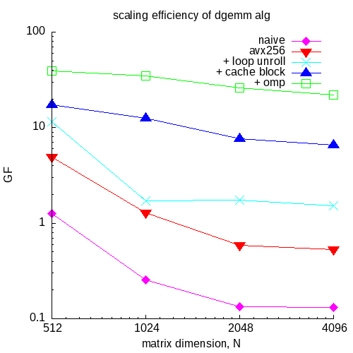

Table of Contents
=================

* [Table of Contents](#table-of-contents)
* [The code](#the-code)
* [The test platform](#the-test-platform)
* [Test results](#test-results)
* [asm analysis](#asm-analysis)
   * [The naive 2D array code, mm.c](#the-naive-2d-array-code-mmc)
   * [The naive 1D version, mm1d.c](#the-naive-1d-version-mm1dc)
   * [Adding asm intrinsics, load/store are not aligned, mmasmu.c](#adding-asm-intrinsics-loadstore-are-not-aligned-mmasmuc)
   * [Same but with aligned load/store, mmasm.c.](#same-but-with-aligned-loadstore-mmasmc)
   * [Using fma instead of separate mul and add, mmfma.c](#using-fma-instead-of-separate-mul-and-add-mmfmac)
   * [Adding loop unrolling, mmasmlu.c](#adding-loop-unrolling-mmasmluc)
   * [Adding cache blocking, mmcb.c and block.c](#adding-cache-blocking-mmcbc-and-blockc)
   * [Scaling efficiency](#scaling-efficiency)

# The code

This example is motivated by sections "Going faster"
from Patterson and Hennessy "Computer Organization and Design".
I'm looking at 5th edition, from 2014.
However, my code differs from that in the book.

The parameters are set in `dgemm.h`:

```
#define   DIM       (1024) // (4096)
#define   TOL       (1e-10)
#define   UNROLL    (4)
#define   BLOCKSIZE (32)
```

The matrices to multiply are of sizes
`DIM` x `DIM`.
The results are considered correct if each
element of the product matrix is
whithin `TOL` from the reference value.
`UNROLL` is the level of loop unrolling,
and `BLOCKSIZE` is the block size for
the cache blocking version.

To enable use of aligned avx 256 intrinsics,
I use `aligned_alloc`, and align on 64 byte boundary.
`malloc` allocations are commented out in `dgemm.c` by default,

To build and run use the usual
```
make all
make run
```

8 omp threads are used by default (total threads on my laptop).
Adjust `OMP_NUM_THREDS` in `Makefile` for your system.

# The test platform

I compile with `-O3 -mavx2` (see the `Makefile`)
using `FreeBSD clang version 18.1.6`.

Running on FreeBSD 14.2 laptop with:

```
Architecture:            amd64
Byte Order:              Little Endian
Total CPU(s):            8
Thread(s) per core:      2
Core(s) per socket:      4
Socket(s):               1
Vendor:                  GenuineIntel
CPU family:              6
Model:                   142
Model name:              Intel(R) Core(TM) i5-8350U CPU @ 1.70GHz
```

From: https://www.intel.com/content/www/us/en/products/sku/124969/intel-core-i58350u-processor-6m-cache-up-to-3-60-ghz/specifications.html
it can boost to 3.6 GHz,
presumably for a single core only.

This CPU uses Kaby Lake R core:
https://en.wikichip.org/wiki/intel/cores/kaby_lake_r,
which is based on Kaby Lake microarch:
https://en.wikichip.org/wiki/intel/microarchitectures/kaby_lake,
which itself seems to be very similar to Skylake --
the page says:
>Core identical to Skylake (client).

In particular, from:
https://en.wikichip.org/wiki/intel/microarchitectures/kaby_lake#Key_changes_from_Skylake
> Same IPC as Skylake (i.e. performance/MHz is unchanged) 

From https://www.intel.com/content/www/us/en/docs/intrinsics-guide/index.html#
under AVX family - FMA, for _mm256_fmadd_ps:
```
Latency and Throughput
Architecture        Latency  Throughput (CPI)
Alderlake           4        0.5
Icelake Intel Core  4        0.5
Icelake Xeon        4        0.5
Sapphire Rapids     4        0.5
Skylake             4        0.5
```

This intrisic is translated into `VFMADD213PD` instruction:
https://www.intel.com/content/www/us/en/docs/cpp-compiler/developer-guide-reference/2021-10/mm-fmadd-pd-mm256-fmadd-pd.html
> The compiler defaults to using the VFMADD213PD instruction
and uses the other forms VFMADD132PD or VFMADD231PD
only if a low level optimization decides it is useful or necessary.
For example, the compiler could change the default
if it finds that another instruction form
saves a register or eliminates a move.

Also from: https://en.wikichip.org/wiki/intel/microarchitectures/kaby_lake#Individual_Core
looks like the kabylake core has 2x fma units,
on ports 0 and 1.

Using the standard eqn for peak flops:

```
ops/cycle/core = FMA/cycle x vec_len x vector units / word len
```

from all above info I get:

```
2 x 256 x 2 / 64 = 16 flops/cycle/core

single core:
base clock @1.7 GHz: 16 * 1.7 = 27.2 GF/core
 max boost @3.6 GHz: 16 * 3.6 = 57.6 GF/core

4 cores:
@1.7 GHz: 4* 16 * 1.7 = 109 GF
```

This is a superscalar microarch,
supporting speculative execution and register
renaming.
The pipeline has 14-19 stages.

The test system has 2x16 GB = 32 GB ddr4 memory:

```
        Size: 16 GB
        Form Factor: SODIMM
        Set: None
        Locator: ChannelB-DIMM0
        Bank Locator: BANK 2
        Type: DDR4
        Type Detail: Synchronous Unbuffered (Unregistered)
        Speed: 2400 MT/s
```

# Test results

There is some run to run variablity in performance.
For `DIM=512` I see something like this:

```
$ OMP_NUM_THREADS=8 ./dgemm.x
     mm2d:   2.73e-01 s   9.82e-01 GF
       mm:   2.11e-01 s   1.27e+00 GF
   mmasmu:   5.47e-02 s   4.91e+00 GF,   3.86e+00 faster than mm version
    mmasm:   5.47e-02 s   4.91e+00 GF,   3.86e+00 faster than mm version
  mmasmlu:   2.34e-02 s   1.15e+01 GF,   9.00e+00 faster than mm version
     mmcb:   1.56e-02 s   1.72e+01 GF,   1.35e+01 faster than mm version
    mmomp:   5.38e-03 s   4.99e+01 GF,   3.92e+01 faster than mm version
```

Note that the asm version `mmasmu` is ~3.85x faster than
the serial version `mm`, while the theoretical speed-up from avx256 is 4x.
The most optimised version `mmomp` is ~40x faster than the naive version `mm`
for this matrix size.
The "most optimised" in this example means: x86 asm intrinsics for packed doubles,
loop unrolling, cache blocking and OpenMP threading.

For `DIM=1024` the max speed-up is ~130x:

```
$ OMP_NUM_THREADS=8 ./dgemm.x
     mm2d:   8.95e+00 s   2.40e-01 GF
       mm:   8.47e+00 s   2.54e-01 GF
   mmasmu:   1.70e+00 s   1.27e+00 GF,   5.00e+00 faster than mm version
    mmasm:   1.66e+00 s   1.29e+00 GF,   5.09e+00 faster than mm version
  mmasmlu:   1.26e+00 s   1.71e+00 GF,   6.73e+00 faster than mm version
     mmcb:   1.72e-01 s   1.25e+01 GF,   4.93e+01 faster than mm version
    mmomp:   6.21e-02 s   3.46e+01 GF,   1.36e+02 faster than mm version
```

Note that adding just simd alone (`mmasmu` and `mmasm`) gives speed-up
significantly higher than the theoretical 4x.
Probably need to compare various cache hit/miss metrics, e.g. with `perf`.

For `DIM=2048` the max speed-up is above 200x:

```
 $ OMP_NUM_THREADS=8 ./dgemm.x
     mm2d:   4.86e+01 s   3.53e-01 GF
       mm:   1.29e+02 s   1.33e-01 GF
   mmasmu:   2.94e+01 s   5.83e-01 GF,   4.37e+00 faster than mm version
    mmasm:   2.92e+01 s   5.87e-01 GF,   4.40e+00 faster than mm version
  mmasmlu:   9.84e+00 s   1.75e+00 GF,   1.31e+01 faster than mm version
     mmcb:   2.23e+00 s   7.72e+00 GF,   5.78e+01 faster than mm version
    mmomp:   6.61e-01 s   2.60e+01 GF,   1.95e+02 faster than mm version
```

and ~170x for `DIM=4096`, with avx256 showing the speed-up
of very close to the theoretical 4x:

```
$ OMP_NUM_THREADS=8 ./dgemm.x
     mm2d:   5.16e+02 s   2.66e-01 GF
       mm:   1.05e+03 s   1.31e-01 GF
   mmasmu:   2.61e+02 s   5.26e-01 GF,   4.01e+00 faster than mm version
    mmasm:   2.59e+02 s   5.31e-01 GF,   4.04e+00 faster than mm version
  mmasmlu:   9.06e+01 s   1.52e+00 GF,   1.16e+01 faster than mm version
     mmcb:   2.08e+01 s   6.61e+00 GF,   5.03e+01 faster than mm version
    mmomp:   6.21e+00 s   2.21e+01 GF,   1.68e+02 faster than mm version
```

# asm analysis

Note that my CPU does not support avx512, only avx256.

The several implementations are discussed in order of increasing optimisation.

## The naive 2D array code, `mm.c`

The key fragment of the asm on my system is:
```
 37                                         # =>    This Inner Loop Header: Depth=3
 38         vmovsd  (%r8,%r10,8), %xmm1             # xmm1 = mem[0],zero
 39         movq    (%rdx,%r10,8), %r11
 40         vmulsd  (%r11,%r9,8), %xmm1, %xmm1
 41         vaddsd  %xmm0, %xmm1, %xmm0
 42         vmovsd  %xmm0, (%rcx,%r9,8)
 43         vmovsd  8(%r8,%r10,8), %xmm1            # xmm1 = mem[0],zero
 44         movq    8(%rdx,%r10,8), %r11
 45         vmulsd  (%r11,%r9,8), %xmm1, %xmm1
 46         vaddsd  %xmm0, %xmm1, %xmm0
 47         vmovsd  %xmm0, (%rcx,%r9,8)
```

which shows the use of 128-bit xmm registers,
and `sd` asm intrinsics i.e. only a single double
is loaded into the register, no vector operation.

## The naive 1D version, `mm1d.c`

The key asm fragment of the naive 1D version
is very similar to the 2D version:

```
110                                         # =>    This Inner Loop Header: Depth=3
111         vmovsd  -24(%r10,%r13,8), %xmm1         # xmm1 = mem[0],zero
112         vmulsd  (%rsi), %xmm1, %xmm1
113         vmovsd  -16(%r10,%r13,8), %xmm2         # xmm2 = mem[0],zero
114         vaddsd  %xmm0, %xmm1, %xmm0
115         vmulsd  (%rsi,%rax,8), %xmm2, %xmm1
116         vaddsd  %xmm0, %xmm1, %xmm0
117         vmovsd  -8(%r10,%r13,8), %xmm1          # xmm1 = mem[0],zero
118         vmulsd  (%rsi,%r15), %xmm1, %xmm1
119         vaddsd  %xmm0, %xmm1, %xmm0
120         vmovsd  (%r10,%r13,8), %xmm1            # xmm1 = mem[0],zero
121         vmulsd  (%rsi,%rbx), %xmm1, %xmm1
122         vaddsd  %xmm0, %xmm1, %xmm0
```

## Adding asm intrinsics, load/store are not aligned, `mmasmu.c`

The unaligned load/store asm intrinsics are:
`_mm256_loadu_pd` and `_mm256_storeu_pd`.
The key fragment shows the use of ymm 256-bit registers
and `pd` versions of arm intrinsics, which operate
with packed doubles, i.e. 4x 64-bit doubles in
256-bit ymm registers.

Note that, in addition to the main loop, L88-101,
there is also the head and the tail code: 

``` 
 65 .LBB0_9:                                # %._crit_edge.us.us
 66                                         #   in Loop: Header=BB0_3 Depth=2
 67         vmovupd %ymm0, (%r15,%r13,8)
 68         addq    $4, %r13
 69         addq    $32, %rdx
 70         cmpq    %rax, %r13
 71         jae     .LBB0_10


 88 .LBB0_6:                                # %.preheader.us.us.new
 89                                         #   Parent Loop BB0_2 Depth=1
 90                                         #     Parent Loop BB0_3 Depth=2
 91                                         # =>    This Inner Loop Header: Depth=3
 92         vbroadcastsd    -8(%r11,%rbx,8), %ymm1
 93         vmulpd  (%r12), %ymm1, %ymm1
 94         vaddpd  %ymm1, %ymm0, %ymm0

 95         vbroadcastsd    (%r11,%rbx,8), %ymm1
 96         vmulpd  (%r12,%r9), %ymm1, %ymm1
 97         vaddpd  %ymm1, %ymm0, %ymm0

 98         addq    $2, %rbx
 99         addq    %r10, %r12
100         cmpq    %rbx, %r8
101         jne     .LBB0_6


106 # %bb.8:                                # %._crit_edge.us.us.epilog-lcssa
107                                         #   in Loop: Header=BB0_3 Depth=2
108         leaq    (%rcx,%r13,8), %r12
109         vbroadcastsd    (%r14,%rbx,8), %ymm1
110         imulq   %rax, %rbx
111         vmulpd  (%r12,%rbx,8), %ymm1, %ymm1
112         vaddpd  %ymm1, %ymm0, %ymm0
113         jmp     .LBB0_9
```

L67 in the head code saves the resulting data in array `c`:
```
 67         vmovupd %ymm0, (%r15,%r13,8)
```
Note that this is an unaligned load/store instruction.

The tail code is likely because the length of the
arrays, `n`, is passed to the function, and the compiler
cannot know if it is a factor of the vector length of not:
```
void mmasmu(int n, double* a, double* b, double* c);
```

Another interesting observation is that the compiler
seems to have auto unrolled by 2 -- L92-94 and L95-97
have vector bcast, mul and add operations at different
addresses of arrays `a` and `b`:
```
 10             __m256d tmp = _mm256_loadu_pd(b+k*n+j);
 11             tmp = _mm256_mul_pd(_mm256_broadcast_sd(a+i*n+k), tmp);
 12             c0 = _mm256_add_pd(c0, tmp);
 13          }
 14          _mm256_storeu_pd(c+i*n+j, c0);
```
L98 increments the loop counter by 2. 

So overall the code has 10 vector instructions:
3x bcast, 3x mul, 3x adds and 1x store.

Note that there is no `vmovupd` for a vector load of `b`
corresponding to `_mm256_loadu_pd(b+k*n+j)`.
Instead, what happens is this -- according to the amd64
calling convention the first 4 arguments are
passed in registers `rdi`, `rsi`, `rdx` and `rcx`:
https://gitlab.com/x86-psABIs/x86-64-ABI,
which for `mmasmu.c` are:
```
void mmasmu(int n, double* a, double* b, double* c)
```

So `rdx` has the address of array `b`,
which is than copied to `r12`:
```
 85         movq    %rdx, %r12
```
and the following vector mul uses the memory location
directly, i.e. bypassing the vector load into a register:
```
 93         vmulpd  (%r12), %ymm1, %ymm1
```
Remember that x86 is *not* a load/store arch,
i.e. it has instruction to operate on memory
directly, without first loading into registers.

To check that the tail code is due to compiler not
knowing the array length, I made a version of `mmasmu`
which takes the array length directly from `dgemm.h`:
```
  7 void mmasmu2(double* a, double* b, double* c)
  8 {
  9    for (int i=0; i<DIM; ++i)
 10       for (int j=0; j<DIM; j+=4) {
 11          __m256d c0 = _mm256_set1_pd(0.0);
 12          for (int k=0; k<DIM; ++k) {
```
and so on.

and indeed, this compiles to a much simpler asm:
```
 40 .LBB0_3:                                #   Parent Loop BB0_1 Depth=1
 41                                         #     Parent Loop BB0_2 Depth=2
 42                                         # =>    This Inner Loop Header: Depth=3
 43         vbroadcastsd    -8(%rdi,%r11,8), %ymm1
 44         vmulpd  -8192(%r10), %ymm1, %ymm1
 45         vaddpd  %ymm1, %ymm0, %ymm0
 46         vbroadcastsd    (%rdi,%r11,8), %ymm1
 47         vmulpd  (%r10), %ymm1, %ymm1
 48         vaddpd  %ymm1, %ymm0, %ymm0
 49         addq    $2, %r11
 50         addq    $16384, %r10                    # imm = 0x4000
 51         cmpq    $1024, %r11                     # imm = 0x400
 52         jne     .LBB0_3
 53 # %bb.4:                                #   in Loop: Header=BB0_2 Depth=2
 54         vmovupd %ymm0, (%rcx,%r9,8)
```

with only 2x bcast, 2x mul and 2x add vector calls.
The vector store is now in the tail code, L54.

Note also that L44,50-51 now have immediates,
not registers, because the compiler knows
all sizes.

## Same but with aligned load/store, `mmasm.c`.

As expected, the only difference compared to the `mmasmu` asm,
is L67:
```
 67         vmovapd %ymm0, (%r15,%r13,8)
```
i.e. aligned store instead of unaligned.

The reason I made an unaligned version, is that
the aligned version would segv for some array lengths.
I need to investigate this further, and maybe compile
with forced alignment.

## Using fma instead of separate mul and add, `mmfma.c`

The outer and the inner loops look like this:

```
 65 .LBB0_9:                                # %._crit_edge.us.us
 66                                         #   in Loop: Header=BB0_3 Depth=2
 67         vmovapd %ymm0, (%r15,%r13,8)

 88 .LBB0_6:                                # %.preheader.us.us.new
 89                                         #   Parent Loop BB0_2 Depth=1
 90                                         #     Parent Loop BB0_3 Depth=2
 91                                         # =>    This Inner Loop Header: Depth=3
 92         vbroadcastsd    -8(%r9,%rbx,8), %ymm1
 93         vfmadd132pd     (%r12), %ymm0, %ymm1    # ymm1 = (ymm1 * mem) + ymm0
 94         vbroadcastsd    (%r9,%rbx,8), %ymm0
 95         vfmadd132pd     (%r12,%r10), %ymm1, %ymm0 # ymm0 = (ymm0 * mem) + ymm1
 96         addq    $2, %rbx
 97         addq    %r11, %r12
 98         cmpq    %rbx, %r8
 99         jne     .LBB0_6

105                                         #   in Loop: Header=BB0_3 Depth=2
106         vbroadcastsd    (%r14,%rbx,8), %ymm1
107         leaq    (%rcx,%r13,8), %r12
108         imulq   %rax, %rbx
109         vfmadd231pd     (%r12,%rbx,8), %ymm1, %ymm0 # ymm0 = (ymm1 * mem) + ymm0
110         jmp     .LBB0_9
```

I think the 2 separate fma calls in the inner loop
correspond to 2x fma units in kabylake/skylake arch:
https://en.wikichip.org/w/images/7/7e/skylake_block_diagram.svg.
See Execution Engine (light green) --
Execution Units (EUs, darker green) --
list of &mu;OP for Ports 0 and 1.


## Adding loop unrolling, `mmasmlu.c`

With unrolling by 4 I get this asm:
```
 61 .LBB0_4:                                #   Parent Loop BB0_2 Depth=1
 62                                         #     Parent Loop BB0_3 Depth=2
 63                                         # =>    This Inner Loop Header: Depth=3
 64         vbroadcastsd    (%rsi,%r12,8), %ymm4
 65         vmulpd  -96(%r15), %ymm4, %ymm5
 66         vaddpd  %ymm5, %ymm3, %ymm3
 67         vmulpd  -64(%r15), %ymm4, %ymm5
 68         vmulpd  -32(%r15), %ymm4, %ymm6
 69         vaddpd  %ymm5, %ymm2, %ymm2
 70         vaddpd  %ymm6, %ymm1, %ymm1
 71         vmulpd  (%r15), %ymm4, %ymm4
 72         vaddpd  %ymm4, %ymm0, %ymm0
 73         incq    %r12
 74         addq    %r8, %r15
 75         cmpq    %r12, %rax
 76         jne     .LBB0_4
 77 # %bb.5:                                # %..preheader_crit_edge.us.us
 78                                         #   in Loop: Header=BB0_3 Depth=2
 79         vmovapd %ymm3, (%r10,%r14)
 80         vmovapd %ymm2, 32(%r10,%r14)    
 81         vmovapd %ymm1, 64(%r10,%r14)
 82         vmovapd %ymm0, 96(%r10,%r14)
```

As expected, note 4x mul and 4x add in the loop,
with offsets of 32 bytes (256 bits).
After the innermost loop, there are 4x store instructions,
again offset by 32 bytes.

Unrolling by 8 also gives the expected asm,
but this version is slower than unrolling by 4,
perhaps because of increased cache misses,
or due to inability of the multiple issue
pipeline to schedule istructions to minimise
stalls:
```
 55 .LBB0_4:                                #   Parent Loop BB0_2 Depth=1
 56                                         #     Parent Loop BB0_3 Depth=2
 57                                         # =>    This Inner Loop Header: Depth=3
 58         vbroadcastsd    (%rsi,%r14,8), %ymm8
 59         vmulpd  -448(%rbx), %ymm8, %ymm9
 60         vaddpd  %ymm7, %ymm9, %ymm7
 61         vmulpd  -384(%rbx), %ymm8, %ymm9
 62         vmulpd  -320(%rbx), %ymm8, %ymm10
 63         vaddpd  %ymm6, %ymm9, %ymm6
 64         vaddpd  %ymm5, %ymm10, %ymm5
 65         vmulpd  -256(%rbx), %ymm8, %ymm9
 66         vaddpd  %ymm4, %ymm9, %ymm4
 67         vmulpd  -192(%rbx), %ymm8, %ymm9
 68         vaddpd  %ymm3, %ymm9, %ymm3
 69         vmulpd  -128(%rbx), %ymm8, %ymm9
 70         vmulpd  -64(%rbx), %ymm8, %ymm10
 71         vaddpd  %ymm2, %ymm9, %ymm2
 72         vaddpd  %ymm1, %ymm10, %ymm1
 73         vmulpd  (%rbx), %ymm8, %ymm8
 74         vaddpd  %ymm0, %ymm8, %ymm0
 75         incq    %r14
 76         addq    %rdi, %rbx
 77         cmpq    %r14, %rax
 78         jne     .LBB0_4
 79 # %bb.5:                                # %..preheader_crit_edge.us.us
 80                                         #   in Loop: Header=BB0_3 Depth=2
 81         vmovapd %ymm7, (%r9,%r11,8)
 82         vmovapd %ymm6, 64(%r9,%r11,8)   
 83         vmovapd %ymm5, 128(%r9,%r11,8)
 84         vmovapd %ymm4, 192(%r9,%r11,8)
 85         vmovapd %ymm3, 256(%r9,%r11,8)
 86         vmovapd %ymm2, 320(%r9,%r11,8)
 87         vmovapd %ymm1, 384(%r9,%r11,8)
 88         vmovapd %ymm0, 448(%r9,%r11,8)
```

## Adding cache blocking, `mmcb.c` and `block.c`

The `block.c` code is very similar to `mmasmlu.c` --
both use the same loop unrolling.
The difference is an extra load in `block.c` because
the prior values of `c` are required:

```
 10             sum[u] = _mm256_load_pd(c+i*n+j+u*4); // load prior value
```

Hence, for this version of dgemm, `c` is set to `0` in
the main, `dgemm.c`.

However, the asm in `block.s` is longer than in `mmasmlu.s`,
probably because the 3 loops for `i,j,k` now do not have
constant start and end.
Instead, the start and end are now variables, passed to `block.c`.
Hence there are more load/store, add and mul calls.

The outer loop starts with load and ends with store:

```
 57 .LBB0_1:                                # %.preheader47

 66         vmovapd (%rax,%r13,8), %ymm3
 67         vmovapd 32(%rax,%r13,8), %ymm2
 68         vmovapd 64(%rax,%r13,8), %ymm1
 69         vmovapd 96(%rax,%r13,8), %ymm0

<2 inner loops>

117         vmovapd %ymm3, 128(%rax,%r13,8)
118         vmovapd %ymm2, 160(%rax,%r13,8)
119         vmovapd %ymm1, 192(%rax,%r13,8)
120         vmovapd %ymm0, 224(%rax,%r13,8)

126         jl      .LBB0_1
```

and the 2 inner loops are:

```
 73 .LBB0_2:                                #   Parent Loop BB0_1 Depth=1
 74                                         # =>  This Inner Loop Header: Depth=2
 75         vbroadcastsd    8(%r8,%r14,8), %ymm4
 76         vmulpd  -96(%r15), %ymm4, %ymm5
 77         vaddpd  %ymm5, %ymm3, %ymm3
 78         vmulpd  -64(%r15), %ymm4, %ymm5
 79         vmulpd  -32(%r15), %ymm4, %ymm6
 80         vaddpd  %ymm5, %ymm2, %ymm2
 81         vaddpd  %ymm6, %ymm1, %ymm1
 82         vmulpd  (%r15), %ymm4, %ymm4
 83         vaddpd  %ymm4, %ymm0, %ymm0
 84         incq    %r14
 85         addq    %rcx, %r15
 86         cmpq    %r11, %r14
 87         jl      .LBB0_2
 88 # %bb.3:                                # %.preheader46.1
 89                                         #   in Loop: Header=BB0_1 Depth=1
 90         vmovapd %ymm3, (%rax,%r13,8)
 91         vmovapd %ymm2, 32(%rax,%r13,8)
 92         vmovapd %ymm1, 64(%rax,%r13,8)
 93         vmovapd %ymm0, 96(%rax,%r13,8)
 94         vmovapd 128(%rax,%r13,8), %ymm3
 95         vmovapd 160(%rax,%r13,8), %ymm2
 96         vmovapd 192(%rax,%r13,8), %ymm1
 97         vmovapd 224(%rax,%r13,8), %ymm0
 98         movq    %r9, %r14
 99         movq    %rsi, %r15
100         .p2align        4, 0x90
101 .LBB0_4:                                #   Parent Loop BB0_1 Depth=1
102                                         # =>  This Inner Loop Header: Depth=2
103         vbroadcastsd    8(%r8,%r15,8), %ymm4
104         vmulpd  -96(%r14), %ymm4, %ymm5
105         vaddpd  %ymm5, %ymm3, %ymm3
106         vmulpd  -64(%r14), %ymm4, %ymm5
107         vmulpd  -32(%r14), %ymm4, %ymm6
108         vaddpd  %ymm5, %ymm2, %ymm2
109         vaddpd  %ymm6, %ymm1, %ymm1
110         vmulpd  (%r14), %ymm4, %ymm4
111         vaddpd  %ymm4, %ymm0, %ymm0
112         incq    %r15
113         addq    %rcx, %r14
114         cmpq    %r11, %r15
115         jl      .LBB0_4
```

Note that the 2 inner loops are nearly indentical,
only `r15` and `r14` are swapped.

I don't really understand why there are 2 inner loops.

## Scaling efficiency

It is interesting to compare how performance of different
algorithms changes with scale, i.e. with the matrix size:


